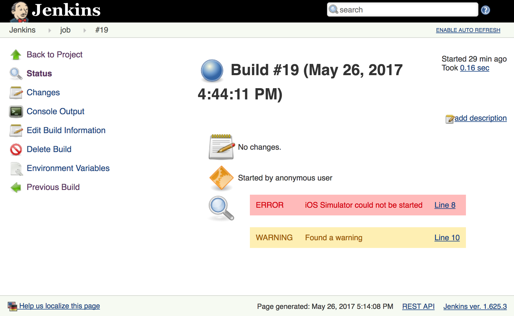

Work in progress.

Features
========
- Find regular expressions in build output and sub build output
- Customizable level of message: info, warning, error
- Customizable message (if non provided the found text is used)
- Dynamic message making use of regular expression groups (can extract info from the regular expression and use it to construct a human readable message)
- Works with Parametrized Trigger Plugin
- Works with Pipeline Plugin
- Supports looking for regular expressions in a buffer of lines (multi line reg exp)
- Creates direct link to the console line, usable if the Console Line Number plugin is installed
- Can fail the build if an entry is found

Install
=======

Tested with Jenkins 1.625.3

* Build the plugin
* Upload the HPI file found in the `target` folder to Jenkins under `Plugin Management - Advanced`

Links to console to a specific line will work if you install the plugin:
https://github.com/ericsmalling/console-linenumber-plugin

Building
========

Run `mvn`.

Pipeline example
================
```groovy
step([$class: "BuildAnalyzerRecorder",
  entries: [
    [$class: "Entry", levelType: "error", regex: "Emulator did not appear to start; giving up"],
    [$class: "Entry", levelType: "error", regex: "Failed to make test runner session", message: "Simulator could not start"]
  ]
])
```

TODO
====

- Tests
- Better support of Pipeline
- Project Action


Screenshot
==========

